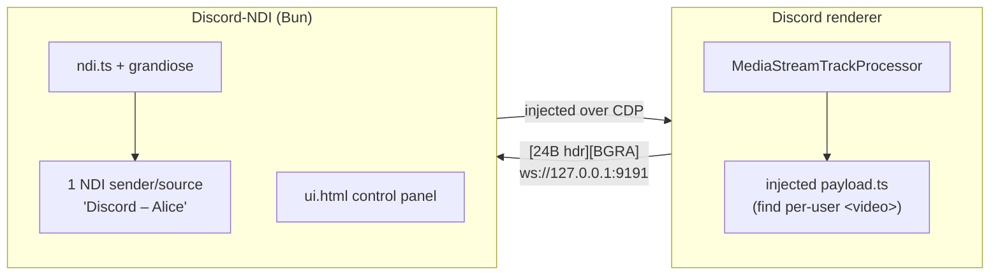

<div align="center">
  
  
  <p>
    <a href="https://github.com/aksisonline/Discord-NDI/stargazers"></a>
    <a href="https://github.com/aksisonline/Discord-NDI/network/members"></a>
    <a href="https://github.com/aksisonline/Discord-NDI/issues"></a>
    
  </p>
  <p>
    <!-- download-mac --><a href="https://github.com/aksisonline/Discord-NDI/releases/download/v0.1.0/Discord-NDI.dmg"></a><!-- /download-mac -->
    <!-- download-win --><a href="https://github.com/aksisonline/Discord-NDI/releases/download/v0.1.0/Discord-NDI-Setup.exe"></a><!-- /download-win -->
  </p>
</div>

<br/>

A standalone app. It does not modify Discord's install: it attaches to the running client over the Chrome DevTools Protocol, injects a small tap into the renderer, and pulls frames out. Turning it off really turns it off, and a Discord update cannot break it.




---


## 🌐 Don't use NDI? Use Web Overlays!

Even though the app heavily relies on NDI, **you don't actually need to use NDI at all**. Just like StreamElements or VDO.ninja, Discord-NDI hosts a local web server that allows you to easily import participant cameras directly into OBS Studio!

Simply open the `http://127.0.0.1:9333` control panel, click on the **Web Source** link for any participant, and paste that URL directly into an **OBS Browser Source**. 

All video frames are seamlessly pulled straight over WebSockets without any NDI configuration required.

---

## Quick Start

> [!NOTE]  
> Discord must be running with remote debugging enabled. If it isn't, the app will automatically relaunch Discord for you.

```bash
# Clone the repository and install dependencies
bun install --cwd app

# Run the backend
bun run app/index.ts
```

This opens a control panel at http://127.0.0.1:9333 with a live list of what is publishing. Capture starts automatically with the process; per-source rows can each be paused.

### Manual Discord Launch

If you prefer to start Discord manually with CDP enabled:
```bash
open -a Discord --args --remote-debugging-port=9222
```

### CLI Flags

- `--port`: Frame ingest port (default: `9191`)
- `--debug-port`: CDP port (default: `9222`)
- `--ui`: Web panel port (default: `9333`)
- `--headless`: Run without the web panel wrapper
- `--dry`: Run without starting actual NDI outputs

---

## ⚠️ Troubleshooting macOS

If macOS throws the **"Discord-NDI is damaged and can't be opened"** error when you launch the app, this is Apple's Gatekeeper blocking unsigned open-source applications downloaded from the internet.

To bypass this safely, open your Terminal and remove the quarantine attribute:
```bash
xattr -cr /Applications/Discord-NDI.app
```

---

## 📹 What gets captured?

| Feature | Official Discord | Vesktop / browser |
| :--- | :---: | :---: |
| **Remote cameras & Go Live** | ✅ | ✅ |
| **Your own camera** | ✅ | ✅ |
| **Audio** | ❌ | ⚠️ (Not yet wired) |

> [!TIP]  
> **Why no audio on the official client?**  
> Video heavily relies on `<video>` rendering with a live `srcObject`, making extraction possible. Audio instead bypasses JavaScript, being decoded and mixed natively in `discord_voice.node` (a C++ addon on libwebrtc). The mix reaches the OS audio device without ever touching standard JS audio nodes.

---

## 🕵️ How participants are identified

Discord's `<video>` elements are created imperatively and carry no React fiber, so we rely on DOM footprinting:

1. **Who**: The enclosing tile tags itself `data-selenium-video-tile="<userId>"`.
2. **Camera vs Go Live**: Both share that ID. Cameras render inside `previewWrapper_*`, whereas Go Live streams render inside `videoContainer_*`. Class hashes frequently change, so the match relies securely on prefixes.
3. **Names**: Video tiles carry no display name, and without an injection mod like Vencord, we cannot query Discord's internal stores. Identifiers are instead extracted from the member sidebar list, pairing a `usernameFont_*` label against the user's avatar URL.

> [!WARNING]  
> All three mechanics rely on Discord internals and carry no permanent stability guarantee.

---

## 🔒 Privacy First

Discord-NDI republishes _other people's_ video. It is purposefully built to verify consent:

- It **refuses to attach** unless you have Discord's **Activity Status** enabled (the setting that broadcasts your current activity/game to others). No activity sharing → no capture.
- During capture, it automatically toggles Discord's **Streamer Mode** to protect your on-screen personal information, acting as a clear indicator that the active session is being broadcasted/recorded.

See `app/index.ts` (`Controller.start`) and `app/payload.ts` for the enforcement implementations.

---

## 🏗️ Architecture & Layout

| Path | Description |
| :--- | :--- |
| `app/index.ts` | Controller: attach, inject, control panel |
| `app/cdp.ts` | Minimal Chrome DevTools Protocol client |
| `app/payload.ts` | Injected renderer tap (self-contained, no imports) |
| `app/ndi.ts` | Frame ingest + grandiose senders |
| `app/protocol.ts` | Wire format definition |
| `app/probe.ts` | Dev helper script: run an expression internally in Discord's renderer |
| `shell/` | Swift (macOS) and Electrobun (Windows) Application Wrappers |

### Native Packaging

The app is written in plain **Bun**, making [Electrobun](https://framework.blackboard.sh/electrobun/) the natural wrapper: its main process *is* Bun, and `grandiose` is a native N-API addon. Its binary references standard Node APIs, meaning it loads smoothly without requiring V8/Node rebuilds. 

---

## 🚧 Known limits & constraints

- **Bandwidth**: Frames cross the WebSocket entirely uncompressed. At `720p 30fps BGRA`, bandwidth is roughly `~55 MB/s` per source. This performs effortlessly within loopback for up to about four simultaneous sources. Beyond that, scaling would require WebCodecs or a move to Shared Memory bindings.
- **Timing constraints**: Sender frame rate is pushed as a flat `30fps`. Ensure your receivers sync off the transmitted timecode instead of expecting realtime locking.
- **Transformations**: Output is unmirrored *(even where Discord mimics a mirror on your own preview)*, and scaling tracks Discord's own internal dynamic resolutions instead of pinning one standardized size.
- **Discord ToS**: Client automation inherently violates Discord's Terms of Service. While enforcement against non-spam tooling continues to be virtually non-existent, run this entirely with your own discretion.

###### *The `plugin/` tree containing an earlier Vencord-based approach was intentionally deleted as this standalone framework entirely superseded it, removing the two-tap divergence issue. Check git history for legacy references.*
